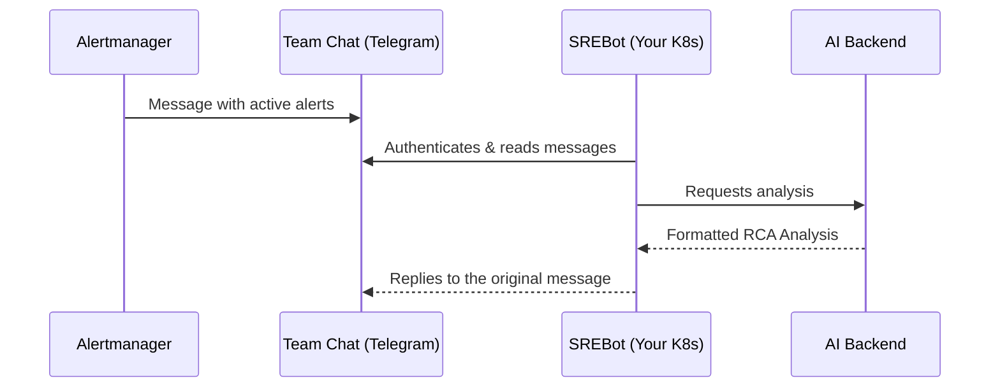

# Introduction to SREBot

**SREBot** is an intelligent observability and monitoring platform designed to rapidly uncover the root causes of incidents (Root Cause Analysis).

It integrates directly into your team's **Telegram Chat**. The bot is deployed privately inside your own Kubernetes infrastructure. It "listens" to messages broadcasted by Prometheus Alertmanager, automatically conducting secure forensic analysis across your local metrics (Prometheus) and logs (Elasticsearch).

## How it works

1. **Deployment (Helm):** SREBot operates directly inside your target Kubernetes namespace. Upon rollout, it leverages embedded functionality to automatically register its listener capabilities into your desired Telegram Chat.
2. **Alert Reception:** Alertmanager posts its routine alert notification into the incident channel.
3. **Deduplication:** The bot captures the chat payload natively. It validates the fingerprint and ignores identical follow-ups to dramatically cut noise.
4. **Investigation:** Empowered with internal K8s cluster capabilities (unrestricted PromQL/ES queries), the bot initiates a secure LLM sweep.
5. **Conclusion:** SREBot dispatches its final RCA report via a direct *reply* to the original Alertmanager message.

## Key Benefits

- **Infrastructure Security:** SREBot runs entirely within your perimeter, negating the requirement for exposing databases externally through risky Ingress pathways.
- **Lower MTTD / MTTR:** The AI automates early-stage investigation routines natively.
- **Intuitive Web Dashboard:** A robust UI provides transparent auditing covering SREBot's active inference pipelines.

Check out the [Getting Started](/en/guide/setup) section to deploy the Helm charts.

## Open Source

The SREBot agent (the component deployed in your infrastructure) is **fully open-source** and available on GitHub:

👉 [github.com/shadrus/srebot](https://github.com/shadrus/srebot)

You can independently inspect the source code, verify that no unauthorized actions take place, and build your own Docker images from source if required.
