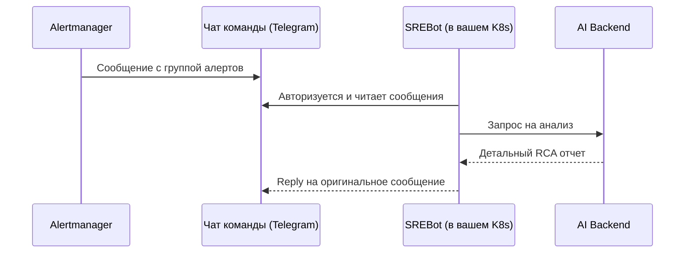

# Введение в SREBot

**SREBot** — это интеллектуальная платформа для observability и мониторинга, которая помогает быстро находить первопричины инцидентов (Root Cause Analysis). 

Она интегрируется напрямую с **Telegram-чатом** вашей команды. Бот деплоится внутри вашей собственной Kubernetes-инфраструктуры, "слушает" сообщения Prometheus Alertmanager и автоматически проводит конфиденциальный анализ метрик (Prometheus) и логов (Elasticsearch).

## Как это работает?

1. **Развертывание (Helm):** Бот SREBot устанавливается в ваш Kubernetes кластер и автоматически регистрируется в целевом Telegram-чате.
2. **Получение алерта:** Alertmanager отправляет стандартное сообщение инцидента в общий чат.
3. **Дедупликация:** Бот перехватывает сообщение. Если инцидент с подобным отпечатком (fingerprint) уже анализируется, бот игнорирует дубликаты.
4. **Анализ:** AI-агент использует предоставленные доступы (Prometheus URL, Elasticsearch URL) из вашего приватного контура Kubernetes для безопасного поиска информации.
5. **Результат:** Бот отправляет готовый RCA отчет ответом (reply) на сообщение Alertmanager.

## Преимущества
- **Безопасность данных:** Бот работает прямо в вашей внутренней K8s сети, не требуя публичных выходов (Ingress) для баз данных. Расследование происходит без утечки архитектурных деталей.
- **Снижение MTTD/MTTR:** AI-агент автоматизирует рутинный этап траблшутинга.
- **Интуитивный дашборд:** Централизованный веб-портал позволяет аналитикам проверить всю историю логики AI-агента.

## Открытый исходный код

Агент SREBot (компонент, который деплоится в вашу инфраструктуру) — **полностью open-source** и доступен на GitHub:

👉 [github.com/shadrus/srebot](https://github.com/shadrus/srebot)

Вы можете самостоятельно изучить исходный код, убедиться в отсутствии нежелательных действий и при необходимости собрать собственный Docker-образ из исходников.

Перейдите к разделу [Быстрый старт](/guide/setup), чтобы узнать, как задеплоить бота через Helm.
